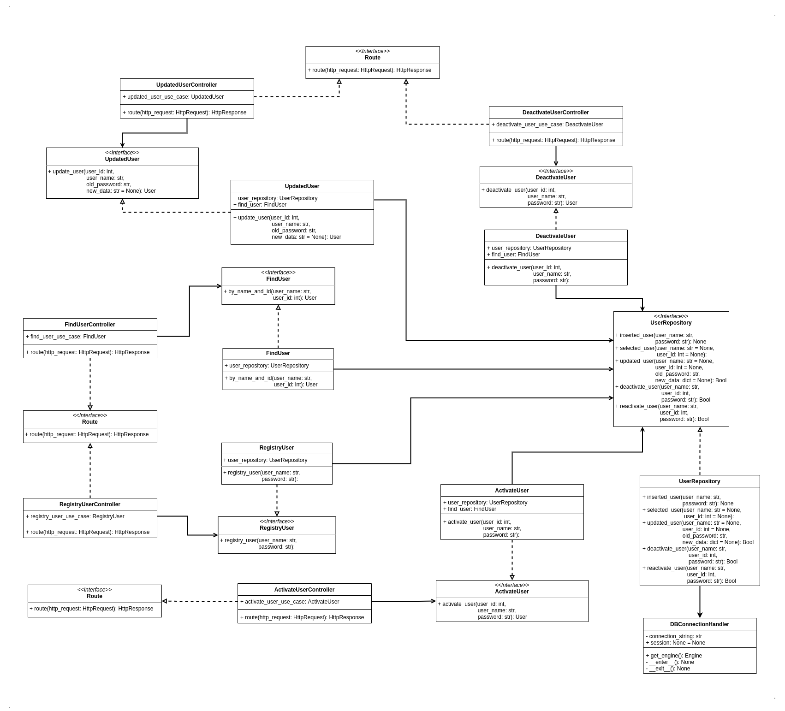

<div align="center">
  <h1>Account Service — Microservice</h1>
  <h4>
    <strong>Status do projeto: </strong> <i>Completo</i> 🤓 🤓 🤓
  </h4>
  <a href="https://wakatime.com/badge/github/joaoo-vittor/account-service"></a>
</div>

----

## Objetivo do projeto

Criar um microsserviço utilizando a *Clean Architecture*, o serviço é responsavel por *registrar um usuário*, por *logar usuário*, por fazer *update de usuário*, por *ativar usuário*, por *desativar usuário* e por *buscar usuário*.

> Observação: O projeto ainda está em produção, sendo assim pode ocorrer mudanças.


## Documentação das rotas

> Documentação feita usando `swagger`: [Link Documentação](https://ecommerce-account-service-jvbs.herokuapp.com/api/v1/doc/)

----

## Diagrama de Classes

</br>



</br>

----
## Configurações iniciais

### Criando um ambiente virtual

Para criar o ambiente virtual é necessário ter o `virtualenv` instalado.


```
virtualenv -p python3 venv
```

### Ativando o ambiente virtual

```
soure venv/bin/activate
```

### Instalando as dependências

```
pip install -r requirements.txt
```

### Rodar testes

Altere o arquivo `docker-compose.yaml`, substitua a linha com `command:` por `command: 'pytest -v -s'` e rode o comando abaixo:

> Observação: É necessário ter o `docker` e o `docker-compose` instalado no seu computador.

🔗 Instalar docker-compose: [Link](https://docs.docker.com/compose/install/)

🔗 Instalar o docker: [Link](https://docs.docker.com/get-docker/)

```
docker-compose up account_service
```
